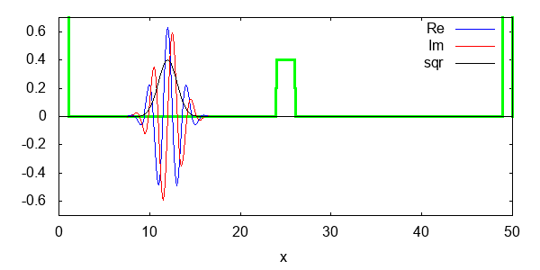

# Split Operator Fourier Transform (SOFT)

## Theoretical Introduction

In this exercise we will see a *rare* example of algorithms for solving the quantum dynamical problem exactly.
Let's consider a time-independent Hamiltonian and its associated time-dependent Schroedinger equation for a system of one particle in one dimension
\[
i\hbar\frac{d}{dt}|\psi> = \hat{H}|\psi> \quad \text{where} \quad \hat{H} = \frac{\hat{P}^2}{2m} + E(\hat{X})
\]
We know that this equation admits at least a formal solution of the kind
\[
|\psi(t)> = \exp\biggl[-\frac{i}{\hbar}\hat{H}t\biggr]|\psi(0)>
\]
that projected on the coordinate basis gives the (still formal) solution
\[
\psi(x_t,t) = \int dx_0 K(x_t, t; x_0, 0)\psi(x_0,0)
\]
where
\[
K(x_t, t; x_0, 0) = <x_t|\exp\biggl[-\frac{i}{\hbar}\hat{H}t\biggr]|x_0>
\]
Note that $x_t$ and $x_0$ are just labels for the coordinates, as if we had $x$ and $x'$, but we will need more variables in what follows and the notation with indexes would become cumbersome.

**Note: If you don't see this immediately try to derive it (hint: project the Schroedinger equation in Dirac's formalism over $<x_t|$ and introduce a resolution of the identity).**

The solution is still *formal* as we have no idea on how to write the kernel $K(x_t, t; x_0, 0)$ in the general case. Nonetheless, we can use the same strategy we adopted in the classical dynamics case to numerically solve the evolution equations with the Louvillian formalism. The strategy is articulated in two steps:

1. Use the time composition property of the propagator to write an expression for $K(x_t, t; x_0, 0)$ as a sum of short timesteps (this is exact).

2. Use Trotter expansion to obtain a computable expression for the short-time propagator (this is an approximation).

First of all let us divide the interval $[0,t]$ in $N$ intervals of length $\varepsilon$ so that $t = N\varepsilon$. The kernel $K$ with this trick can be written as
\[
K(x_t, t; x_0, 0) = <x_t|\exp\biggl[-\frac{i}{\hbar}\hat{H}t\biggr]|x_0> = <x_t|\exp\biggl[-\frac{i}{\hbar}\hat{H}\frac{t}{N}\biggr]\dots\exp\biggl[-\frac{i}{\hbar}\hat{H}\frac{t}{N}\biggr]|x_0>
\]
where the dots implies the product of a total of $N$ terms.

**Question: Can we do that? Why?**

We can now introduce $N$ resolutions of the identity between subsequent products of operators so to have
\[
\begin{aligned}
K(x_t, t; x_0, 0) = &\int dx_{N-1}\dots dx_{1}<x_N|\exp\biggl[-\frac{i}{\hbar}\hat{H}\varepsilon\biggr]|x_{N-1}> \times \\
&\times <x_{N-1}|\exp\biggl[-\frac{i}{\hbar}\hat{H}\varepsilon\biggr]|x_{N-2}>\dots<x_1|\exp\biggl[-\frac{i}{\hbar}\hat{H}\varepsilon\biggr]|x_0>
\end{aligned}
\]
where we have used $\varepsilon = \frac{t}{N}$.

Let us now consider the action of a single propagator for a time $\varepsilon$ on a base vector $|x>$.
If we take into account the total Hamiltonian, the action is not known, since we do not know how to treat the some of the $\hat{P}^2$ operator plus a function of the $\hat{X}$ operator, in this case $E(\hat{X})$.
But the situation would be different if we could use the property of the exponential to write
\[
\exp\biggl[-\frac{i}{\hbar}\hat{H}\varepsilon\biggr]|x> = \exp\biggl[-\frac{i}{\hbar}\biggl(\frac{\hat{P}^2}{2m} + E(\hat{X})\biggr)\varepsilon\biggr]|x> = \exp\biggl[-\frac{i}{\hbar}\frac{\hat{P}^2}{2m}\varepsilon\biggr]\exp\biggl[-\frac{i}{\hbar}E(\hat{X})\varepsilon\biggr]|x>
\]
because in this case we would know, from basic operator algebra, that
\[
\exp\biggl[-\frac{i}{\hbar}E(\hat{X})\varepsilon\biggr]|x> = \exp\biggl[-\frac{i}{\hbar}E(x)\varepsilon\biggr]|x>
\]
It will then remain to evaluate the action of the function of the operator $\hat{P}$ on the state, which is something that we know it is not immediate in the coordinate basis. But then a simple change of basis from the coordinate to the momentum basis would put us in the same situation as we were before.

**Question: Can we use the properties of the exponentials to split the propagator? Why?**

We know, again from the lecture on classical mechanics, that the equality
\[
\exp[A + B] = \exp[A]\exp[B]
\]
is not true when the two entities $A$ and $B$ do not commute.

**Exercise: Show this for the two operators $\hat{A}$ and $\hat{B}$ (hint: a function of an operator is defined through its Taylor expansion, i.e. two functions of operators are equal if their Taylor expansions are equal...).**

In particular we know that, for non-commuting operators, the following relation holds
\[
\exp[\hat{A} + \hat{B}] = \exp[\hat{A}]\exp[\hat{B}] + \mathcal{O}([A,B]^2)
\]
or, in a more accurate form
\[
\exp[\hat{A} + \hat{B}] = \exp\biggl[\frac{\hat{B}}{2}\biggr]\exp[\hat{A}]\exp\biggl[\frac{\hat{B}}{2}\biggr] + \mathcal{O}([A,B]^3)
\]
Note that, in particular in this second form, the order of the operators $A$ and $B$ is not important, so that the break-up of the exponential can be carried on in both ways.
Moreover, considering a small parameter $\varepsilon$ multiplying the sum $A + B$ we get the useful relation
\[
\exp[\varepsilon(\hat{A} + \hat{B})] = \exp\biggl[\varepsilon\frac{\hat{B}}{2}\biggr]\exp[\varepsilon\hat{A}]\exp\biggl[\varepsilon\frac{\hat{B}}{2}\biggr] + \mathcal{O}(\varepsilon^3[A,B]^3)
\]
It is now clear that we can now directly apply this break-up (known as second order Trotter break-up) to our short-time propagator to get
\[
\exp\biggl[-\frac{i}{\hbar}\biggl(\frac{\hat{P}^2}{2m} + E(\hat{X})\biggr)\varepsilon\biggr] = \exp\biggl[-\frac{i}{\hbar}E(\hat{X})\frac{\varepsilon}{2}\biggr]\exp\biggl[-\frac{i}{\hbar}\frac{\hat{P}^2}{2m}\varepsilon\biggr]\exp\biggl[-\frac{i}{\hbar}E(\hat{X})\frac{\varepsilon}{2}\biggr]
\]
This is an approximation, but we know up to what order it is accurate. And moreover, we are now in the situation of being able to solve, step by step, the *formal* solution of the time-dependent Schroedinger equation. Indeed, considering the first 'step' of the split of the whole solution we have
\[
\exp\biggl[-\frac{i}{\hbar}E(\hat{X})\frac{\varepsilon}{2}\biggr]\exp\biggl[-\frac{i}{\hbar}\frac{\hat{P}^2}{2m}\varepsilon\biggr]\exp\biggl[-\frac{i}{\hbar}E(\hat{X})\frac{\varepsilon}{2}\biggr]|x_1><x_0|\psi(0)>
\]
The action of the first bid of the short-time propagator is easy computed as
\[
\exp\biggl[-\frac{i}{\hbar}E(\hat{X})\frac{\varepsilon}{2}\biggr]\exp\biggl[-\frac{i}{\hbar}\frac{\hat{P}^2}{2m}\varepsilon\biggr]|x_1>\exp\biggl[-\frac{i}{\hbar}E(x_1)\frac{\varepsilon}{2}\biggr]<x_0|\psi(0)>
\]
Now we have a problem in principle as we cannot easily apply the operator $\hat{P}^2$ to the base vector $|x_1>$. We can nonetheless use a change of variable to switch to the momentum basis. This can be done through the insertion of a resolution of the identity in $p$ space:
\[
\exp\biggl[-\frac{i}{\hbar}E(\hat{X})\frac{\varepsilon}{2}\biggr]\int dp \exp\biggl[-\frac{i}{\hbar}\frac{\hat{P}^2}{2m}\varepsilon\biggr]|p><p|x_1>\exp\biggl[-\frac{i}{\hbar}E(x_1)\frac{\varepsilon}{2}\biggr]<x_0|\psi(0)>
\]

##Split-Operator Fourier Transform (SOFT) program

for the course [Computational Methods in Molecular Quantum Mechanics CH-452](http://edu.epfl.ch/coursebook/en/computational-methods-in-molecular-quantum-mechanics-CH-452).

Original program written by Sara Bonella.

### HOW TO PLAY WITH IT:
- fork it
- clone it from your repository
- modify SOFT.c, e.g.,
     - grid and time step settings
     - initial position and speed
     - mass
     - potential type (barrier, morse, harmonic)
- compile it with $make
- run SOFT.x
- visualize the output .dat using gnuplot (e.g., $gnuplot psi.gnuplot)
- report any bug!

### EXAMPLE:
This is a gaussian wave packet, with a starting position and momentum, hitting a rectangular potential barrier.

